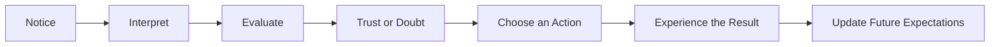

# Chapter 1: Persuasion, Branding, and Design

Persuasion is the practice of helping shape what people notice, how they interpret it, whether they trust it, and what they decide to do next.

Designers persuade whenever they choose a color, arrange information, name a product, select an image, or decide what should stand out first. A package can make a product seem practical, luxurious, friendly, urgent, or trustworthy before anyone has examined the product itself.

Persuasion is not automatically dishonest. It becomes ethically questionable when it hides important information, exploits vulnerability, removes meaningful choice, or pressures people into acting against their interests.

## The Plain White T-Shirt

Imagine a plain white T-shirt. The shirt itself does not change, but its presentation can change dramatically.

- **Practical basic:** "A dependable everyday T-shirt."
- **Premium essential:** "A carefully cut wardrobe foundation."
- **Sustainable choice:** "A long-lasting alternative to disposable fashion."
- **Limited release:** "Available this week in a small first run."
- **Community symbol:** "The shirt worn by people who support local art."
- **Budget option:** "Simple clothing at a price that leaves room for other needs."

Each description directs attention toward different qualities. The cotton, shape, and color may remain identical, but the meaning surrounding the shirt changes.

This is branding: the creation of associations and expectations around a product, service, organization, or person. Branding does not manufacture value from nothing. Ideally, it helps people recognize and understand real value. When branding makes a product appear to possess qualities it does not have, persuasion has moved toward deception.

## Persuasion, Coercion, and Manipulation

These terms are related, but they are not interchangeable.

| Approach | How it works | Role of choice | Ethical concern |
| --- | --- | --- | --- |
| **Persuasion** | Presents reasons, evidence, stories, or benefits that may influence a decision | Choice remains meaningful | Can become misleading if information is distorted |
| **Coercion** | Uses threats, punishment, intimidation, or force | Choice is substantially restricted | The person is pressured through fear or harm |
| **Manipulation** | Exploits confusion, emotion, vulnerability, or hidden information | Choice may appear free but is undermined | The influence is concealed or unfairly engineered |

A designer persuading someone to consider a plain white T-shirt might show its fabric quality, explain its fit, and display honest customer reviews. A coercive seller might threaten a penalty for refusing to buy. A manipulative seller might falsely claim that only one shirt remains when the inventory is full.

The difference is not simply whether influence occurs. Influence is everywhere. The important questions are whether the audience can understand what is happening, whether relevant information is available, and whether the decision remains genuinely theirs.

## Cialdini's Principles of Influence

Psychologist Robert Cialdini identified several recurring principles that affect how people respond to requests and messages. These principles describe tendencies, not guarantees. People do not always behave according to them, and the same principle can be used responsibly or irresponsibly.

### Reciprocity

People often feel inclined to return a favor or respond to something they have received.

A clothing brand might offer a useful guide to caring for T-shirts before inviting readers to shop. The guide can create goodwill, but it should not make people feel trapped into buying something.

Ethical use means giving something genuinely useful and making the later request clear and optional.

### Commitment and Consistency

People tend to value consistency between their actions, stated beliefs, and self-image.

Suppose someone tells a designer, "I want to buy fewer, better-made clothes." A brand might connect its T-shirt to durability and repairability. That can help the customer act on an existing value. It becomes problematic when a small action is used to pressure someone into a much larger commitment they did not anticipate.

### Social Proof

When people are uncertain, they often look at what others appear to be doing.

A T-shirt page might show that many customers chose the shirt or include reviews from people with similar needs. Social proof is useful when it is accurate and relevant. A vague claim such as "Everyone is buying this" can mislead, especially if the evidence is weak or invented.

### Liking

People are generally more receptive to messages from individuals, groups, or brands they like or identify with.

A T-shirt campaign might feature people who share the audience's interests, humor, or sense of style. Liking can create connection, but a friendly personality does not prove that the product is good. Designers should be careful not to use charm to distract from poor quality or hidden costs.

### Authority

People often give extra weight to credible experts, institutions, or sources of knowledge.

A clothing brand could explain its fabric testing through a qualified textile specialist. Authority should be relevant to the claim being made. A famous person's popularity does not automatically make them an expert on fabric durability.

### Scarcity

People often value opportunities more when they believe those opportunities are limited.

A genuinely small production run may be described as limited. False countdown timers, fake stock warnings, and permanently "ending soon" promotions create pressure without providing honest information.

### Unity

Cialdini later described unity as the influence created by a shared identity or sense of belonging.

A T-shirt may be presented as part of a campus community, a neighborhood project, or a group supporting a particular cause. Shared identity can create meaningful connection. It should not be used to imply that people are disloyal, uncaring, or inferior if they do not purchase.

## Two More Useful Ideas

Cialdini's principles are only part of the picture. Designers can also learn from other areas of psychology, behavioral economics, rhetoric, and communication.

### Framing

Framing is the way a message defines what aspect of a situation seems most important. The same facts can produce different interpretations depending on how they are organized.

The plain white T-shirt can be framed as:

- **A gain:** "Add a versatile staple to your wardrobe."
- **A loss avoided:** "Stop replacing shirts that wear out after a few washes."
- **A values choice:** "Buy fewer items and keep them longer."
- **A style choice:** "Build more outfits from one simple foundation."

The frame does not necessarily change the facts. It changes the mental angle from which people view them. Ethical framing emphasizes a real and relevant aspect of the product rather than hiding inconvenient information.

### Dual-Process Thinking

People use both quick, intuitive judgments and slower, more deliberate reasoning. Different researchers describe these processes in different ways, but the general distinction is useful for designers.

A bold photograph, familiar color, or memorable slogan can create an immediate impression of the T-shirt. Detailed measurements, fabric information, return policies, and customer reviews support more deliberate evaluation.

Good communication supports both processes. It can attract attention quickly while also giving people enough information to make a considered decision. A design that depends entirely on impulse leaves the audience with too little support for careful judgment.

### Ethos, Pathos, and Logos

Classical rhetoric often discusses three ways a message can persuade:

- **Ethos:** credibility and character
- **Pathos:** emotion and identification
- **Logos:** reasoning and evidence

A T-shirt campaign might establish ethos by explaining how the shirt is made, use pathos by showing a meaningful personal story, and use logos by providing measurements, material details, and price comparisons.

These modes work together. Emotion is not automatically manipulation, and facts are not automatically persuasive. The ethical question is whether each element helps the audience understand the offer or merely pushes them past their ability to evaluate it.

## Attention Is Not the Same as Understanding

Designers often begin by asking, "How can I make people notice this?" That is a useful question, but it is incomplete.

A bright red label may attract attention to the white T-shirt. A short slogan may make the product memorable. A dramatic photograph may create interest. But attention can lead to misunderstanding if the design makes an unimportant feature prominent while burying a major limitation.

A stronger sequence is:

The audience does not simply see a design and obey it. They notice some elements, interpret them through prior knowledge, evaluate the offer, decide whether to trust it, and then act. Their later experience affects whether they trust similar messages in the future.

If the white T-shirt is advertised as exceptionally durable but quickly falls apart, the immediate sale may come at the cost of future trust. Ethical persuasion considers the whole chain, not only the click or purchase.

## Questions for Designers

Before trying to persuade someone, a designer should ask:

1. What decision am I asking the audience to make?
2. Who benefits from that decision?
3. What does the audience need to know to decide fairly?
4. Am I emphasizing a real quality or creating an unsupported impression?
5. Could a reasonable person misunderstand this message?
6. Am I using urgency because the situation is genuinely time-sensitive?
7. Are testimonials, numbers, and claims accurate and relevant?
8. Does the audience have a practical way to decline, compare, or reconsider?
9. Am I taking advantage of fear, insecurity, confusion, or limited attention?
10. Would I be comfortable explaining this design choice openly to the people affected?
11. What happens after the person acts?
12. Does the product or experience support the promise made by the design?

These questions shift persuasion from "How do I get the result I want?" toward "How do I help people make a decision with clear eyes?"

## Explore Further

Search for:

- Robert Cialdini principles of influence primary sources
- ethical persuasion in design
- framing effect psychology examples
- dual-process theories of judgment and decision-making
- ethos pathos logos rhetoric
- dark patterns in user interface design
- behavioral economics loss aversion and choice architecture
- social proof and online reviews research

When researching these topics, compare multiple reliable sources and distinguish original research from simplified summaries.

## What You Should Remember

Persuasion shapes attention, interpretation, trust, and action. Branding gives products meaning, but it should connect people with real value rather than manufacture false impressions.

Cialdini's principles, framing, dual-process thinking, and rhetorical appeals help explain why messages influence people. They are tools for understanding communication, not excuses to exploit an audience.

The plain white T-shirt can be presented as practical, premium, sustainable, scarce, or communal without changing the shirt itself. That power makes design consequential. Ethical persuasion respects choice, provides relevant information, avoids deception, and considers what happens after the audience acts.
