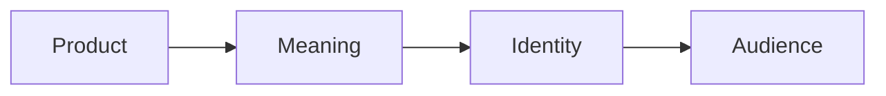

# Chapter 3: Design Language

Visual design carries ideas before anyone reads every word. A typeface can suggest authority or informality. A grid can imply order and reliability. A crowded composition can feel energetic, excessive, urgent, or playful. Color, spacing, image choice, material, and motion all help an audience decide what something means.

A design language is a recurring system of visual choices. It gives a product, publication, organization, or interface a recognizable voice. Learning design history helps you notice that these choices are not neutral. They come from arguments about what design should do, who it should serve, and how much personality it should show.

One useful way to study modern design history is to follow a continuing tension:

- **order and disruption**
- **universality and identity**
- **clarity and expression**
- **grid and anti-grid**
- **restraint and abundance**
- **function and irony**

These are not switches with one correct setting. Contemporary designers still move between them, sometimes within the same project.

## From Early Modernism to Bauhaus

Early modernism developed alongside industrialization, mass production, new technologies, urban life, and social change. Designers and artists questioned whether inherited decorative styles suited a modern world. They explored abstraction, geometric form, new materials, photography, and the possibilities of designing for many people rather than for a single wealthy patron.

Modernist design often sought a visual language that felt purposeful and current. Ornament was not always rejected for the same reasons, but many modernists wanted form to relate more directly to structure, use, production, or communication. The result was not one uniform style. It was a field of experiments connected by an interest in making a new visual order.

The Bauhaus, founded in Germany in 1919, became an influential school for bringing art, craft, and design into conversation. Its teaching emphasized materials, making, experimentation, and the relationship between form and use. The school included different teachers and approaches, so it should not be reduced to a single look. Still, its reputation helped establish the idea that design education could connect studio practice with technology, industry, and social life.

A Bauhaus-influenced poster, building, or object might use geometric forms, asymmetrical balance, limited materials, and a clear relationship between visual structure and purpose. Those choices can make an object feel efficient and forward-looking. They can also make it feel impersonal if the designer treats efficiency as the only value that matters.

## The Swiss or International Typographic Style

After the Second World War, the Swiss or International Typographic Style became associated with disciplined typography, objective presentation, sans-serif type, photography, and modular grids. Designers used the grid to organize information and create consistency across posters, publications, identities, and other communication systems.

The grid is more than a set of invisible lines. It is a way of deciding what belongs together, what receives emphasis, and how a reader moves through information. A restrained palette and carefully aligned type can make a message feel clear, serious, and dependable.

The word “objective” needs care. A design can look neutral while still reflecting choices about language, audience, culture, technology, and power. A clean layout does not remove interpretation; it guides interpretation quietly. The International Typographic Style valued clarity and order, but its visual language was not outside history or ideology.

The product supplies physical qualities, the design gives those qualities meaning, and the meaning offers the audience an identity or experience to consider. The audience's response can then influence how the product and its design are understood.

## Postmodernism as a Reaction

Postmodern design emerged in part as a reaction against the certainty associated with some modernist claims. Where modernism could seek restraint, universality, rational order, and a shared visual language, postmodern designers often questioned whether one system could serve every audience or situation.

Postmodern work might borrow historical references, mix typefaces, use quotation and irony, disrupt the grid, layer images, or make visual abundance part of the message. It could treat contradiction, personality, popular culture, and local identity as resources rather than problems.

This does not mean that postmodernism simply equals disorder, or that modernism equals boring minimalism. Both categories contain many practices and debates. The useful lesson is that design values can be challenged. A grid can organize information, but breaking the grid can call attention to hierarchy. Restraint can improve clarity, but abundance can express plurality or excess. Irony can question authority, but it can also make a message harder to understand.

## An Ongoing Argument

| Design value | What it can make possible | What it can risk | A question for designers |
| --- | --- | --- | --- |
| **Order** | Comparison, consistency, trust | Sterility or hidden hierarchy | What does this order help people see, and what does it hide? |
| **Disruption** | Attention, challenge, new interpretations | Confusion or spectacle without substance | What expectation are we disrupting, and why? |
| **Universality** | Broad recognition and shared systems | Erasure of local identity and difference | Who is treated as the default audience? |
| **Identity** | Belonging, specificity, cultural expression | Exclusion or tokenism | Whose identity is represented, and with what authority? |
| **Clarity** | Fast comprehension and access | Oversimplification | What necessary complexity have we removed? |
| **Expression** | Personality, emotion, memorability | Noise or self-indulgence | Does the expressive choice serve the audience? |
| **Grid** | Structure, rhythm, scalable systems | Inflexibility | Which relationships does the grid make visible? |
| **Anti-grid** | Energy, emphasis, and alternative relationships | Weak navigation or arbitrary chaos | What new relationship does the break create? |
| **Restraint** | Focus, calm, and legibility | Blandness or false neutrality | What can be removed without losing meaning? |
| **Abundance** | Richness, plurality, and intensity | Overload or unequal emphasis | Can the audience find a path through the richness? |
| **Function** | Usefulness, access, and purpose | Narrow definitions of value | What human need is being served? |
| **Irony** | Distance, critique, and self-awareness | Ambiguity or exclusion of people who miss the reference | Who understands the joke, and who bears its cost? |

A contemporary website may combine a strict grid with an expressive typeface. A product interface may use restrained screens for routine tasks and disruptive animation to signal a major change. A brand may use a universal system while making room for regional language and imagery. History continues because designers keep negotiating these choices.

## The Plain White T-Shirt Across Two Design Languages

Consider the exact same plain white T-shirt: same shirt, same fabric, same shape, and same price. Its presentation can still make it feel like a different product.

### A Modernist Presentation

A modernist presentation might place the shirt against a plain background, use a disciplined grid, choose a restrained sans-serif typeface, and provide concise information about material, fit, care, and price. The photograph could be carefully lit and centered. The message might emphasize usefulness, clarity, and the shirt's role as a dependable everyday object.

The audience may experience the shirt as rational, efficient, honest, and widely accessible. The design asks them to understand the product through structure and function.

### A Postmodern Presentation

A postmodern presentation might combine unexpected type sizes, historical references, an intentionally crowded composition, playful quotation, and a visible disruption of the grid. The same shirt could be styled beside contrasting images or accompanied by an ironic message about the supposedly universal “basic.”

The audience may experience the shirt as a commentary on fashion, identity, and the idea of neutrality itself. The design asks them to notice that even a plain object can carry cultural assumptions.

The shirt has not changed. The design language changes the questions surrounding it. A modernist presentation may ask, “How clearly can this object serve everyday life?” A postmodern presentation may ask, “Who decided what counts as basic, and why?” Either approach can be thoughtful or shallow. The choice should follow the intended meaning and audience, not a desire to imitate a historical style.

## How to Read a Design

When you encounter a poster, package, website, building, or interface, slow down before deciding whether you like it. Read it as a set of choices.

1. **Start with attention.** What do you notice first? Is that controlled by size, contrast, color, position, motion, or imagery?
2. **Map the structure.** Where are the edges, alignments, margins, columns, and empty spaces? Is there a grid, and does anything break it?
3. **Examine typography.** What do the typeface, scale, weight, spacing, and line length suggest about the speaker and the audience?
4. **Notice the material and image choices.** Does the design feel precise, handmade, industrial, archival, playful, luxurious, ordinary, or confrontational?
5. **Ask what is being treated as universal.** Who appears in the design? Who is absent? What assumptions does the design make about literacy, technology, taste, or culture?
6. **Identify the tension.** Is the design balancing clarity with expression, or function with irony? Which side leads?
7. **Consider the behavior it invites.** Does it ask you to read, compare, buy, explore, identify, remember, or question?
8. **Test the interpretation.** Look for evidence in the whole composition instead of relying on one striking detail.

A design is not successful merely because it looks modern, minimal, rebellious, or historical. Its choices should work together for a purpose, and that purpose should be understandable enough to evaluate.

## Museum Research

Museum and institutional collections are useful because they give you access to documented objects, collection records, curatorial descriptions, and high-quality images. They also remind you that design history is made of specific objects and contexts, not just a list of style labels.

Use search terms such as:

- early modernist graphic design poster
- Bauhaus typography object
- Bauhaus furniture material study
- Swiss Style grid poster
- International Typographic Style typography
- modernist corporate identity manual
- postmodern graphic design typography
- postmodern architecture ornament and irony
- design grid versus anti-grid

Search within credible collections and archives, including The Metropolitan Museum of Art, MoMA, Cooper Hewitt, the V&A, Bauhaus archives, national libraries, university collections, and other established institutions. Search the institution's own collection interface when possible. You can also use a general search engine to discover collection records, then open the record on the institution's official site.

Do not assume that a search result is an authentic or correctly dated object. Verify the title, maker or designer, date, medium, collection, and institutional record yourself. Compare the museum's description with the image, and record what is documented separately from what you infer. If an object is attributed, undated, reconstructed, or shown only in a secondary article, say so in your notes.

For a short research exercise, choose one modernist or Bauhaus-related object and one Swiss, International Typographic, or postmodern object. For each, record three visible choices, the likely audience action, and one question the object leaves open. Avoid claiming that an object represents an entire movement unless the evidence supports that conclusion.

## What You Should Remember

Visual design carries ideas through structure, type, image, material, color, spacing, and behavior. Modernism, Bauhaus practice, the Swiss or International Typographic Style, and postmodernism offer different answers to questions about order, universality, clarity, expression, and identity.

History is not a staircase toward one final style. Contemporary web and product design still combines grids and anti-grids, restraint and abundance, function and irony. The same plain white T-shirt can feel like a rational everyday tool or a commentary on identity depending on its design language.

Read design by examining its choices, its tensions, its assumptions, and the action it invites. Research actual objects in credible collections, verify the evidence, and let historical ideas sharpen your own decisions rather than dictate them.
