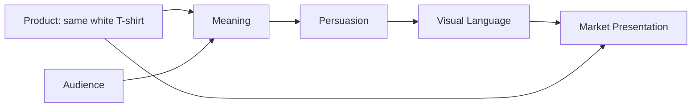

# Chapter 4: The White T-Shirt Case Study

Here is the challenge: sell the same plain white T-shirt four different ways without pretending it is four different physical products.

The shirt is ordinary in the best sense. It is well made, comfortable, plain, and dependable. Its cut, fabric, color, and price remain substantially the same in every concept. What changes is the product presentation: who we imagine buying it, what they are invited to feel, how we persuade them, and what visual world surrounds the shirt.

This is not a trick. It is a compact demonstration of branding and design. A product does not arrive with one inevitable meaning. Meaning is built through choices.

## Concept One: The Open Road Basic

**Audience:** Students, travelers, and people who want clothing that will not slow down an active day.

**Chosen brand archetype:** Explorer.

**Persuasion principles being used:** Social proof through honest stories from people who wear the shirt on varied days; commitment and consistency by connecting the shirt to a stated desire for a simpler, more flexible wardrobe; and scarcity only when a production run is genuinely limited.

**Visual-design language:** Expansive photography, open compositions, natural light, sturdy sans-serif type, and practical information placed where it is easy to find. The layout leaves room to breathe. Maps, routes, and changing horizons can suggest movement without claiming that the shirt itself creates adventure.

**Headline:** "Leave Room for the Next Turn."

**Short product story:** You do not know whether today ends at the library, a late bus, a friend's kitchen, or a place you have never seen. This plain white T-shirt is a dependable layer for a day that refuses to stay planned.

**What meaning the customer is actually being invited to buy:** Freedom from overthinking what to wear. The customer is not buying a passport or a new personality; they are buying the feeling that a simple choice leaves attention available for the day ahead.

**Imagery direction:** A sequence of real, ordinary transitions: a packed bag, a campus walkway, a train window, a shared table, and a shirt being washed and worn again. Avoid using spectacular scenery as proof of qualities the shirt does not possess.

**Ethical concern or possible misuse:** Adventure imagery can romanticize constant movement or imply that people who stay home are less alive. Social proof can also become misleading if selected stories suggest that every customer lives an exciting, mobile life. Show variety and keep claims about durability, comfort, and care verifiable.

## Concept Two: The Measured Essential

**Audience:** People who value clear information, low visual noise, and clothes that earn their place through use.

**Chosen brand archetype:** Sage, with a restrained Ruler tendency.

**Persuasion principles being used:** Authority through relevant and clearly presented product information; consistency by helping customers act on a stated preference for buying fewer, more useful items; and reciprocity through a genuinely useful care guide rather than a vague promotional freebie.

**Visual-design language:** Restrained modernist and Swiss-influenced design: a modular grid, generous margins, precise alignment, a limited palette, a sans-serif typeface, and straightforward photography. Product measurements, fabric information, care instructions, return terms, and price receive visible, equal respect.

**Headline:** "Nothing Extra. Everything Explained."

**Short product story:** A basic garment becomes more useful when its decisions are visible. Here is the fit, the fabric, the care routine, the price, and the reason each detail matters. The shirt does not need a dramatic story to be worth understanding.

**What meaning the customer is actually being invited to buy:** Discernment. The customer is invited to feel capable of choosing well, without being rushed by noise, novelty, or status signals.

**Imagery direction:** A centered shirt, measured views, close details of seams and fabric, and diagrams that help comparison. The photography should be calm and accurate, not artificially luxurious.

**Ethical concern or possible misuse:** A clean, neutral-looking presentation can make subjective choices appear objective. The grid may hide rather than remove bias, and technical language can exclude people who are unfamiliar with clothing terms. Clarity requires plain explanations and accessible alternatives, not just a polished layout.

## Concept Three: The Basic Is a Costume

**Audience:** Students, artists, and culturally curious shoppers who enjoy questioning familiar categories.

**Chosen brand archetype:** Rebel, with a Jester and Creator edge.

**Persuasion principles being used:** Liking through humor and shared cultural references; unity through inviting the audience into a community that notices the rules behind supposedly neutral objects; and contrast through deliberately breaking expectations about what a basic shirt should look or sound like.

**Visual-design language:** Disruptive postmodern composition: clashing type scales, cropped images, layered references, unexpected color, visible edits, and an anti-grid arrangement. The design may quote the language of catalogues, uniforms, luxury fashion, and advertising, but it should make clear when the reference is playful rather than factual.

**Headline:** "The Most Suspiciously Ordinary Shirt."

**Short product story:** White, plain, and apparently innocent. Yet every "basic" carries ideas about taste, class, gender, work, cleanliness, and who gets to look effortless. Wear the shirt, then decide what its blankness is doing.

**What meaning the customer is actually being invited to buy:** Critical distance and expressive independence. The customer is invited to treat an ordinary object as a prompt for thinking, styling, and making meaning rather than accepting its category as natural.

**Imagery direction:** The shirt shown in deliberately incompatible settings: carefully folded, awkwardly oversized in a collage, paired with a handwritten annotation, and placed beside images of other supposed basics. Let the contrast raise a question instead of pretending the shirt has become rare or revolutionary.

**Ethical concern or possible misuse:** Irony can become an insider test. If only a narrow group understands the joke, the design may exclude the very audience it claims to challenge. Disruption can also distract from price, fit, or care information. Keep the facts available and do not use critique as camouflage for an ordinary product with inflated claims.

## Concept Four: The Shirt That Joins In

**Audience:** People looking for comfortable, familiar clothing for shared everyday life: roommates, families, clubs, classrooms, and neighbors.

**Chosen brand archetype:** Everyperson, supported by Caregiver.

**Persuasion principles being used:** Unity through belonging and shared routines; liking through warm, recognizable situations; and social proof through specific, honest accounts of how groups use the shirt. Reciprocity could appear as a practical repair or care resource that helps the shirt last.

**Visual-design language:** Warm documentary photography, conversational typography, inclusive casting, and a flexible layout that feels organized without feeling corporate. The design should show several kinds of people and ordinary settings rather than presenting belonging as a polished lifestyle prize.

**Headline:** "There Is Room for You in This One."

**Short product story:** One shirt for the morning rush, the club meeting, the grocery run, the study session, and the person who borrowed it and forgot to give it back. It is not remarkable because it makes you stand out. It is useful because it lets you take part.

**What meaning the customer is actually being invited to buy:** Belonging without performance. The customer is invited to feel welcomed and prepared for shared life, not pressured to prove that they are part of a group by making a purchase.

**Imagery direction:** A sequence of ordinary interactions: friends sharing laundry advice, a student arriving late to a group project, a family setting a table, and neighbors helping carry boxes. Show different bodies, ages, abilities, and styles without turning inclusion into decoration.

**Ethical concern or possible misuse:** Belonging is powerful and easy to exploit. A campaign can imply that people who do not buy are outsiders, or use diverse faces to sell a product without changing the organization's behavior. Make the invitation optional, avoid shame, and ensure the actual customer experience is as welcoming as the images.

## What Actually Changed?

The product stayed almost completely still. The meaning moved.

| Concept | Audience | Archetype | Persuasion principles | Visual language | Meaning being offered | Main ethical risk |
| --- | --- | --- | --- | --- | --- | --- |
| **The Open Road Basic** | Students, travelers, active planners | Explorer | Social proof, commitment and consistency, truthful scarcity | Open compositions, natural light, movement | Freedom from wardrobe overthinking | Romanticizing adventure or exaggerating performance |
| **The Measured Essential** | Information-seeking minimalists | Sage / Ruler | Authority, consistency, useful reciprocity | Swiss-influenced grid, restraint, precise type | Discernment and confident choice | False neutrality or inaccessible expertise |
| **The Basic Is a Costume** | Artists and culturally curious shoppers | Rebel / Jester / Creator | Liking, unity, contrast | Postmodern collage, anti-grid, irony | Critical distance and expressive independence | Insider humor, confusion, or inflated claims |
| **The Shirt That Joins In** | Groups and everyday community members | Everyperson / Caregiver | Unity, liking, social proof, useful reciprocity | Warm documentary style, inclusive everyday scenes | Belonging without performance | Manufacturing exclusion or token inclusion |

The table is not saying that each audience is one fixed type. A single person may want Explorer freedom on Monday, Sage-like clarity while shopping, Rebel expression at a concert, and Everyperson belonging at dinner. Segmentation is a design tool, not a diagnosis.

## How the Presentation Works

A market presentation is produced by several elements working together. The product gives the message something concrete. The audience brings needs and expectations. Meaning gives the object a possible role in the customer's life. Persuasion shapes attention and trust. Visual language makes the meaning recognizable.

The diagram does not mean that design can make a product mean anything at all. The shirt's actual fit, fabric, price, and performance limit what can be honestly promised. A presentation becomes credible when the visual story, persuasive invitation, and lived product experience support one another.

## A Student's Design Challenge

Choose one of the four concepts and sketch three touchpoints: a product page, a package, and a social post. Keep the physical shirt unchanged. Change only the audience, message, imagery, layout, type, and surrounding story.

Then ask:

1. Can someone identify the intended archetype without seeing its label?
2. What is the first thing the presentation asks the audience to notice?
3. Which persuasion principle is doing the most work?
4. What fact about the shirt remains constant across all four concepts?
5. What meaning is being offered beyond the physical object?
6. Where could the design become misleading, exclusionary, or manipulative?
7. Does the customer experience after purchase support the promise?

The exercise is useful because it separates product decisions from meaning decisions. You learn to see that a dramatic change in market position does not require a dramatic change in the object itself.

## What You Should Remember

One ordinary white T-shirt can become an Explorer's reliable companion, a Sage's measured essential, a Rebel's cultural question, or an Everyperson's invitation to join in. The physical product can stay substantially the same while the audience, archetype, persuasion, imagery, and design language change.

A strong presentation is not just a clever headline. It aligns what the product can honestly do with what the audience is being invited to feel, imagine, or become. Each concept also creates ethical responsibilities: do not fake scarcity, disguise opinion as fact, use irony to hide missing information, or turn belonging into pressure.

The designer's job is to make the meaning legible, the invitation fair, and the experience worthy of the promise.
