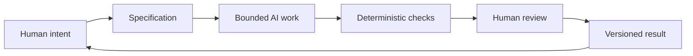

# Chapter 5: From Creative Intent to Reliable AI Work

The earlier chapters have examined three connected questions:

- **Persuasion:** What response are we trying to enable?
- **Archetype:** What meaning or identity are we expressing?
- **Design language:** How should that meaning look and feel?

Together, these questions form a high-level control framework for creative and technical work assisted by AI. They do not tell an AI system every word to write or every line of code to produce. They establish direction, boundaries, and standards for judging the result.

Think back to the plain white T-shirt. Persuasion might define the response we want: help someone feel ready to choose a simple, dependable garment. Archetype might define the identity: Explorer, Sage, Rebel, or Everyperson. Design language might determine the experience: open and spacious, measured and grid-based, disruptive and ironic, or warm and documentary.

The shirt is still the shirt. The framework coordinates the meaning around it.

## A Three-Part Control Framework

A useful creative brief can begin with three questions:

| Framework layer | Core question | Example for the white T-shirt |
| --- | --- | --- |
| **Persuasion** | What response are we trying to enable? | Help the audience feel confident choosing a versatile everyday garment |
| **Archetype** | What meaning or identity are we expressing? | The Sage: thoughtful, informed, and deliberate |
| **Design language** | How should that meaning look and feel? | Restrained typography, clear comparison, precise grid, calm photography |

The layers should reinforce one another. A message that asks people to think carefully should not bury its facts in a confusing interface. A Rebel identity should not be presented through language that quietly pressures people to conform. A playful Jester concept still needs truthful product information.

This is why a high-level framework is more useful than a pile of disconnected style instructions. It gives people and AI a way to make related decisions.

## Why Specifications Matter

An AI task should be bounded by a specification because an open-ended request leaves too many important decisions implicit. A specification states what the work must accomplish, what constraints apply, what evidence counts as success, and what must not happen.

For a chapter, a specification might require a certain audience, tone, sections, examples, table, diagram, and final summary. For a software feature, it might define inputs, outputs, error behavior, supported environments, tests, and files that may be changed. For a visual concept, it might define the audience, archetype, visual language, accessibility needs, and claims that require verification.

A good specification is not a cage around creativity. It protects the purpose of the work while leaving room for the worker, designer, or AI system to find an effective solution. It also makes disagreement more useful. Instead of saying, “I do not like this,” a reviewer can ask, “Which requirement or intended response does this fail to support?”

The specification should answer questions such as:

1. Who is the work for?
2. What should the audience understand, feel, or do?
3. What meaning or identity should the work express?
4. What format, content, and technical constraints apply?
5. What claims must be accurate or verified?
6. What does success look like?
7. What is explicitly out of scope?

Without these boundaries, an AI system can produce something fluent, attractive, or functional that solves the wrong problem.

## Why Git Matters

Git provides traceability and recovery. It records changes as a sequence of versions, allowing a team to inspect what changed, compare alternatives, identify when a behavior appeared, and return to a known earlier state when necessary.

That matters especially when AI is involved. AI-assisted work can move quickly, and a plausible change can touch more than the author expects. Small commits, descriptive messages, and focused branches make the work easier to understand. A version history can show which specification produced a result, which revision introduced a problem, and which earlier version is safe to recover.

Git is not a substitute for judgment. A perfectly recorded bad decision is still a bad decision. Its value is that it makes decisions visible and reversible enough for people to examine them.

A practical workflow might look like this:

- create a branch for a focused task
- make a small, understandable change
- run the relevant checks
- review the diff and the result
- commit the change with a meaningful description
- merge only after the work meets the agreed standard

This rhythm turns a vague stream of generated output into an inspectable history.

## Why Deterministic Checks Help

A deterministic automated check produces the same answer when the same input and conditions are provided. Examples include checking whether a required file exists, a test passes, a document contains required headings, a code formatter reports no differences, or a build completes successfully.

These checks are useful because they provide cheap, repeatable validation. They can catch obvious failures quickly and consistently, freeing human attention for questions that machines handle poorly. A Markdown check can confirm that Chapter 5 contains a required heading. A test can confirm that a function returns the expected result for a known input. A type checker can catch an incompatible value before a user encounters it.

Deterministic checks are not proof that the work is good. A document can contain every required heading and still be dull or misleading. Code can pass tests and still have a confusing interface. Checks answer narrow questions reliably; they do not replace broader evaluation.

The best checks are close to the specification. If the requirement says “the diagram must connect intent to review,” write a check for the expected structure. If the requirement says “users can recover from an error,” test that behavior directly.

## Why AI Review Is Useful but Probabilistic

AI review can be valuable for finding patterns, suggesting missing cases, explaining unfamiliar code, comparing a draft with a specification, or generating questions a human reviewer should consider. It can provide a second perspective quickly, especially when the work is large.

But AI review is probabilistic. It can miss a real defect, misunderstand context, accept an invented claim, or confidently describe a problem that is not present. Its wording may sound certain even when its evidence is weak. A review generated by AI is therefore an input to judgment, not a final verdict.

Use AI review for questions such as:

- What requirements appear to be missing?
- Which edge cases deserve a test?
- Where could a reader misunderstand the message?
- Are there inconsistent terms, assumptions, or interactions?
- What should a human inspect more closely?

Then verify important findings against the source, the specification, the running system, or a trustworthy record. The more consequential the decision, the less acceptable it is to treat a fluent review as proof.

## Human Review Is the Pit Stop

Imagine a race car during a long event. Automation can keep the car moving around the track: formatting tools run, tests execute, builds package, and scripts check required structures. The car can cover a lot of distance without stopping.

But selected moments deserve a pit stop. Mechanics inspect the tires, fuel, damage, and parts that automated motion cannot fully judge. They do not stop after every meter, because that would destroy momentum. They also do not refuse to stop at all, because speed without inspection eventually becomes expensive.

Human review works the same way. People should choose deliberate inspection points based on risk, novelty, uncertainty, and consequence. At a pit stop, a human may ask:

- Is this still the problem we intended to solve?
- Does the result communicate the intended meaning to the actual audience?
- Are its claims truthful, contextualized, and fair?
- Does the work behave acceptably outside the tested examples?
- What changed, and do we understand why?
- Is this result ready to release, or does it need another lap of work?

The metaphor is not an excuse to review everything manually or to trust automation blindly. It is a reminder to place human attention where it has the greatest value.

## The End-to-End Loop

The loop begins with human intent and returns to human judgment. A specification translates intent into boundaries. Bounded AI work explores or executes within those boundaries. Deterministic checks answer cheap, repeatable questions. Human review considers meaning, truthfulness, context, and consequences. Git or another versioning system preserves the result and makes the next decision traceable.

The loop can repeat. A failed check may require a small repair. A human review may reveal that the specification was incomplete. A versioned result may expose a pattern that should change the next task. Reliable AI-assisted work is not a single prompt followed by a single answer; it is a controlled cycle of intention, production, checking, judgment, and learning.

## What Humans Remain Responsible For

Automation can generate options, transform material, run procedures, and surface patterns. It cannot transfer responsibility away from the people who define the goal and release the result.

Humans remain responsible for:

- **Judgment:** deciding whether the result is fit for its purpose
- **Meaning:** deciding what the work communicates and whether that meaning is appropriate
- **Truthfulness:** verifying claims, sources, evidence, and representations
- **Context:** understanding the audience, culture, stakes, history, and consequences
- **Final decisions:** approving, revising, rejecting, publishing, or deploying the work

This responsibility applies even when the system produced most of the wording, image, layout, or code. “The AI generated it” describes a process; it does not answer whether the result is accurate, ethical, useful, or ready.

## A Final White T-Shirt Test

Suppose an AI system is asked to create a product page for the same plain white T-shirt. A weak prompt says, “Make it compelling.” A stronger specification says:

- the audience is first-year students building a small, flexible wardrobe
- the response to enable is confident consideration, not pressured purchase
- the archetype is Sage
- the design language is restrained and grid-based
- the page must show fit, material, care, price, and return information clearly
- it must not invent scarcity, testimonials, sustainability claims, or performance data
- automated checks must confirm required sections and links
- a human must inspect the final page for clarity, accuracy, accessibility, and tone

The AI may still produce several possible pages. That is useful. The framework gives the possibilities a direction and gives the team a way to select among them.

Persuasion identifies the response, archetype identifies the meaning, and design language identifies the felt form. Specification, checks, version history, and human review turn those creative decisions into a responsible working process.

## Questions for Next Week

1. When should a creative task remain open-ended, and when does it need a precise specification?
2. Which requirements in your next project can be checked deterministically?
3. Where would a human pit stop add the most value?
4. What kinds of claims should never be accepted without verification?
5. How could Git make your next experiment easier to understand or recover?
6. What does your project invite the audience to feel, imagine, or do?
7. Which archetype best describes the meaning you want to express?
8. What design language would make that meaning legible without overwhelming the audience?
9. What would count as a successful result, beyond simply producing something?
10. What decision will remain yours even if AI performs most of the work?

## What You Should Remember

Persuasion asks what response we are trying to enable. Archetype asks what meaning or identity we are expressing. Design language asks how that meaning should look and feel. Together, they give AI-assisted creative and technical work a direction that is more useful than a vague request for something “good.”

Specifications bound the task, Git provides traceability and recovery, deterministic checks provide cheap repeatable validation, and AI review offers useful but probabilistic perspective. Human review remains essential for judgment, meaning, truthfulness, context, and final decisions.

Let automation keep the work moving, but choose deliberate pit stops. The goal is not merely to generate faster. It is to produce work that is understandable, inspectable, truthful, and worth releasing.
